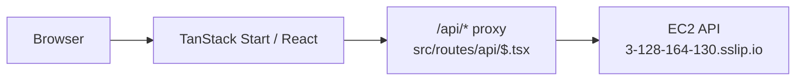

# JobLens Web (Lovable)

Production Web client for JobLens. It owns login, Profile editing, resume upload,
job URL/manual analysis, and the test-account Debug Console.

| | |
|--|--|
| **Live** | https://job-lens-main.lovable.app |
| **Backend repo** | [nicole732470/joblens](https://github.com/nicole732470/joblens) (API + extension + shared UI) |
| **This repo** | Lovable-managed UI only |

---

## Architecture (this repo)



- All API calls go through **same-origin `/api/*`** — no direct browser calls to EC2.
- Analyze uses **`POST /analyze/async`** + polling (same as Chrome extension).
- Report HTML comes from **synced** `src/lib/report-view-core.js` (source: `joblens/shared/report-view.js`).

Full system docs live in the **joblens** repo:

- [docs/ARCHITECTURE.md](https://github.com/nicole732470/joblens/blob/main/docs/ARCHITECTURE.md)
- [docs/MULTI_SURFACE.md](https://github.com/nicole732470/joblens/blob/main/docs/MULTI_SURFACE.md)
- [docs/SCORING_STANDARD.md](https://github.com/nicole732470/joblens/blob/main/docs/SCORING_STANDARD.md)

---

## Local dev

```bash
npm install
npm run dev
```

API URL for the proxy is configured in `src/routes/api/$.tsx` and defaults to
the production HTTPS endpoint.

Verify a production build:

```bash
npm run build
```

---

## Deploy

1. Rebase on Lovable-generated remote commits when necessary.
2. Push to GitHub.
3. **Publish** in Lovable to update the live URL; a Git push alone may not deploy.

After changing shared report UI or tokens in **joblens**, run from that repo:

```bash
./scripts/sync-shared-ui.sh
./scripts/sync-design-tokens.sh
```

Then Publish here and reload the Chrome extension.

---

## Auth → extension

When users log in on this site, `joblens/extension/sync-auth.js` (from the other repo) copies the JWT to the Chrome extension so LinkedIn analysis uses the same profile and resume.

**LinkedIn login ≠ JobLens login.**
